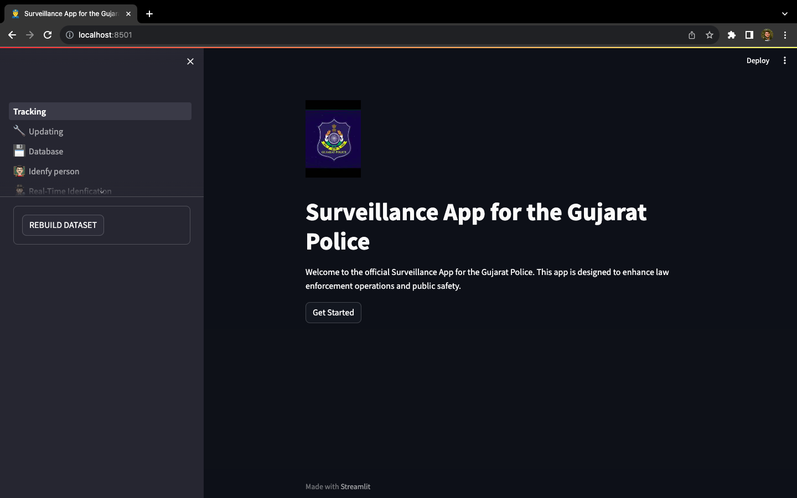

# Smart Policing using AI and Facial Recognition System (FRS)

## Overview : 

####   -->  Our Smart Policing solution leverages the power of CCTV cameras and computer vision technology to enhance public safety and security. The system uses a network of CCTV cameras to monitor public spaces. Each camera stream is processed by our computer vision algorithms, enabling real-time identification and validation of individuals with criminal history. This robust system provides a range of features to ensure a safer community.

  
  
  
  

  
  
 

#### 🔍 **Real-Time Validation of Individuals with Criminal History**:
####  - We have developed a cutting-edge system that integrates Facial Recognition System (FRS) for instant identification and validation of individuals with criminal records, enabling law enforcement to act swiftly and decisively.
 

#### 🚫 **Detection of People Loitering in Unauthorized Areas**:
#### - Leveraging behavioral analysis, our system can detect and alert authorities about individuals loitering in unauthorized areas, enhancing public safety and security.
 
 

#### 🚨 **Crime Scene Detection and Violence Detection**:
#### - Our project incorporates advanced algorithms for real-time detection of crime scenes and violent activities, empowering law enforcement to respond rapidly to potential threats, ensuring the safety of the community.
 

#### 🚓 **Smart Police Deployment**:
#### - Data-driven decisions facilitated by FRS and multi-camera tracking allow for efficient resource allocation and police deployment, ensuring the best utilization of resources and enhancing overall safety.
 

#### 📣 **Message Alerts to Authorities with Photos**:
#### - Our system can send real-time message alerts to the authorities, including photos and critical information about incidents. This feature enhances the responsiveness of law enforcement, enabling them to take immediate action.
 

Feel free to reach out to me  if you have any questions or need further information
